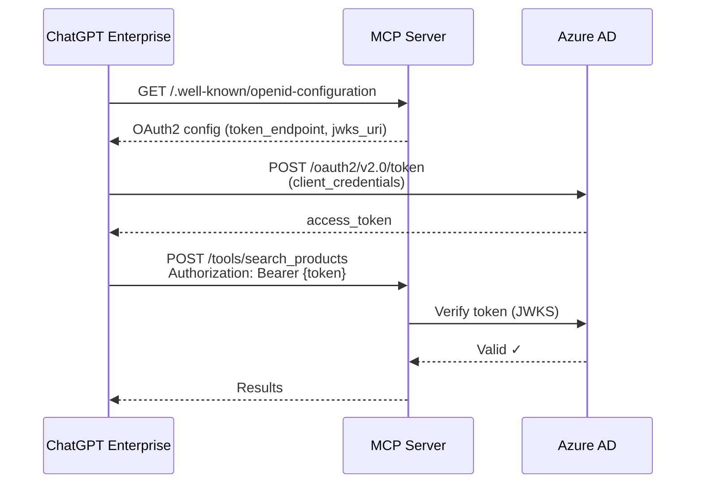
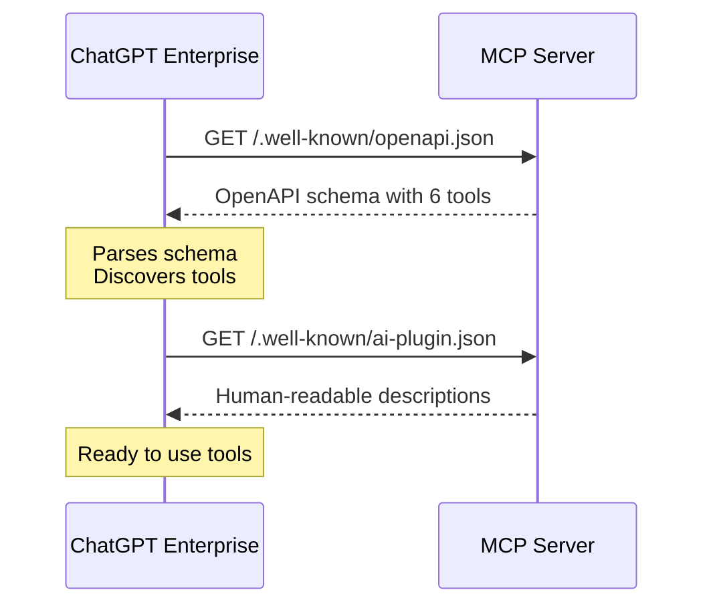
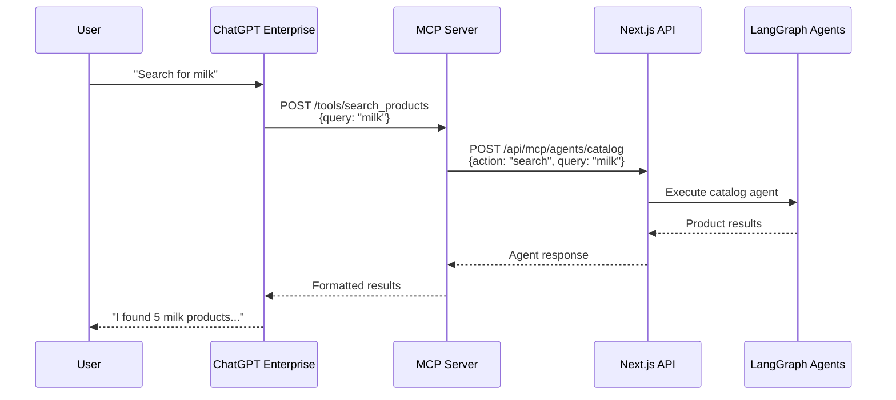

# ChatGPT Enterprise Integration Guide

This guide explains how to integrate your MCP server with ChatGPT Enterprise using OAuth2 authentication and OpenAPI schema discovery.

## Overview

ChatGPT Enterprise discovers and connects to your MCP server through a standardized flow:

1. **Discovery**: ChatGPT Enterprise fetches your OpenAPI schema to discover available actions
2. **Authentication**: Uses OAuth2 client credentials flow to obtain access tokens
3. **Execution**: Calls your tools via REST endpoints with proper authentication

## Required Endpoints

Your MCP server now exposes these discovery endpoints:

### 1. OpenID Connect Discovery
```
GET /.well-known/openid-configuration
```
Returns OAuth2 provider configuration (issuer, token endpoint, JWKS URI, supported grant types).

**Purpose**: Allows ChatGPT Enterprise to discover how to authenticate.

### 2. OAuth Protected Resource Metadata
```
GET /.well-known/oauth-protected-resource
```
Returns resource-specific OAuth2 metadata per [RFC 8693](https://datatracker.ietf.org/doc/html/rfc8693).

**Purpose**: Declares this MCP server as an OAuth2 protected resource.

### 3. OpenAPI Schema (Critical!)
```
GET /.well-known/openapi.json
```
Returns OpenAPI 3.0 schema describing all available actions/tools.

**Purpose**: ChatGPT Enterprise uses this to discover what actions are available and how to call them.

### 4. Actions Manifest
```
GET /.well-known/ai-plugin.json
```
Returns ChatGPT Actions manifest (similar to GPT plugins format).

**Purpose**: Provides human-readable descriptions and metadata.

### 5. Tool Execution Endpoints
```
POST /tools/{tool_name}
```
REST-style endpoints for each tool (e.g., `/tools/search_products`, `/tools/add_to_cart`).

**Purpose**: ChatGPT Enterprise calls these to execute actions.

## Setup Instructions

### Step 1: Configure Azure AD (or your OAuth2 provider)

1. **Create an App Registration** in Azure AD:
   - Go to Azure Portal → Azure Active Directory → App registrations
   - Click "New registration"
   - Name: "Shopping Assistant MCP"
   - Save the **Client ID** and **Tenant ID**

2. **Create a Client Secret**:
   - Go to your app → Certificates & secrets
   - Click "New client secret"
   - Save the **Client Secret Value**

3. **Configure API Permissions** (if needed):
   - Add any required permissions
   - Grant admin consent

4. **Note your endpoints**:
   - Token Endpoint: `https://login.microsoftonline.com/{tenant-id}/oauth2/v2.0/token`
   - JWKS URI: `https://login.microsoftonline.com/{tenant-id}/discovery/v2.0/keys`
   - Issuer: `https://login.microsoftonline.com/{tenant-id}/v2.0`

### Step 2: Configure Your MCP Server

Update `.env.local`:

```bash
# Authentication Mode
MCP_AUTH_MODE=oauth2

# OAuth2 Configuration
OAUTH2_OPENID_CONFIG_URL=https://login.microsoftonline.com/{your-tenant-id}/.well-known/openid-configuration
OAUTH2_JWKS_URI=https://login.microsoftonline.com/{your-tenant-id}/discovery/v2.0/keys
OAUTH2_ISSUER=https://login.microsoftonline.com/{your-tenant-id}/v2.0
OAUTH2_AUDIENCE={your-client-id}
OAUTH2_TOKEN_ENDPOINT=https://login.microsoftonline.com/{your-tenant-id}/oauth2/v2.0/token

# Optional: Restrict clients
ALLOWED_MCP_CLIENTS={chatgpt-enterprise-client-id}
```

### Step 3: Start Your MCP Server

```bash
npm run dev
# or for production:
npm start
```

Verify all endpoints are working:

```bash
./test-chatgpt-endpoints.sh
```

Expected output:
```
✅ Health Check
✅ OpenID Connect Discovery
✅ OAuth Protected Resource Metadata
✅ OpenAPI Schema (6 tools discovered)
✅ Actions Manifest
```

### Step 4: Configure ChatGPT Enterprise

1. **Access ChatGPT Enterprise Admin Portal**:
   - Navigate to Settings → Integrations or Actions

2. **Add New Action**:
   - Click "Add Action" or "New Integration"
   - Choose "OpenAPI" or "Custom API"

3. **Configure Connection**:
   - **Base URL**: `http://your-server:3001` (or your public URL)
   - **OpenAPI Schema URL**: `http://your-server:3001/.well-known/openapi.json`
   - Click "Import" or "Fetch Schema"

4. **Configure Authentication**:
   - **Auth Type**: OAuth2 (Client Credentials)
   - **Token URL**: `https://login.microsoftonline.com/{tenant-id}/oauth2/v2.0/token`
   - **Client ID**: Your Azure AD Client ID
   - **Client Secret**: Your Azure AD Client Secret
   - **Scope**: (leave blank or use default scope)

5. **Test the Connection**:
   - ChatGPT Enterprise should show 6 available actions:
     - `search_products`
     - `add_to_cart`
     - `view_cart`
     - `checkout`
     - `add_payment_method`
     - `get_deals`

6. **Save and Enable**:
   - Save the configuration
   - Enable the integration for your organization or specific users

## How It Works

### Authentication Flow



### Tool Discovery Flow



### Tool Execution Flow

When a user asks ChatGPT to search for products:



## Available Tools

### 1. search_products
Search the product catalog.

**Input**:
```json
{
  "query": "milk",
  "category": "dairy",
  "limit": 10
}
```

### 2. add_to_cart
Add items to shopping cart.

**Input**:
```json
{
  "productCode": "milk-001",
  "quantity": 2
}
```

### 3. view_cart
View current cart contents.

**Input**:
```json
{}
```

### 4. checkout
Complete the checkout process.

**Input**:
```json
{
  "cartSummary": "2 items, total $12.50"
}
```

### 5. add_payment_method
Add a payment method.

**Input**:
```json
{
  "type": "credit_card"
}
```

### 6. get_deals
Get current deals and promotions.

**Input**:
```json
{
  "category": "produce"
}
```

## Testing

### Test Discovery Endpoints

```bash
# Run the comprehensive test
./test-chatgpt-endpoints.sh

# Or test individual endpoints
curl http://localhost:3001/.well-known/openid-configuration
curl http://localhost:3001/.well-known/openapi.json
curl http://localhost:3001/.well-known/ai-plugin.json
```

### Test Tool Execution (with OAuth2)

```bash
# 1. Get access token
TOKEN=$(curl -X POST "https://login.microsoftonline.com/{tenant}/oauth2/v2.0/token" \
  -H "Content-Type: application/x-www-form-urlencoded" \
  -d "grant_type=client_credentials" \
  -d "client_id={client-id}" \
  -d "client_secret={client-secret}" \
  -d "scope={audience}/.default" \
  | jq -r '.access_token')

# 2. Call a tool
curl -X POST http://localhost:3001/tools/search_products \
  -H "Authorization: Bearer $TOKEN" \
  -H "Content-Type: application/json" \
  -d '{"query": "milk", "limit": 5}'
```

## Troubleshooting

### ChatGPT Enterprise Can't Discover Actions

**Check**:
1. Verify OpenAPI schema endpoint returns valid JSON:
   ```bash
   curl http://localhost:3001/.well-known/openapi.json | jq .
   ```

2. Ensure `openapi` field is set to `"3.0.0"` or higher

3. Check that `paths` contains your tools:
   ```bash
   curl http://localhost:3001/.well-known/openapi.json | jq '.paths | keys'
   ```

### Authentication Fails

**Check**:
1. Verify OpenID Discovery returns correct token endpoint:
   ```bash
   curl http://localhost:3001/.well-known/openid-configuration | jq '.token_endpoint'
   ```

2. Test token acquisition manually:
   ```bash
   curl -X POST "{token_endpoint}" \
     -d "grant_type=client_credentials" \
     -d "client_id={id}" \
     -d "client_secret={secret}"
   ```

3. Verify your MCP server can validate the token:
   ```bash
   # Check logs for authentication errors
   npm run dev
   ```

### Tool Execution Fails

**Check**:
1. Verify tool endpoints exist:
   ```bash
   curl http://localhost:3001/.well-known/openapi.json | jq '.paths | keys'
   ```

2. Check server logs for errors:
   ```bash
   # The server logs all requests
   npm run dev
   ```

3. Ensure Next.js API is running and accessible:
   ```bash
   curl http://localhost:3000/health
   ```

## Production Deployment

### Security Considerations

1. **Use HTTPS**: Deploy behind a reverse proxy with TLS
2. **Restrict Client IDs**: Set `ALLOWED_MCP_CLIENTS` to whitelist
3. **Monitor Token Usage**: Track which clients are accessing your MCP
4. **Rate Limiting**: Add rate limiting to prevent abuse
5. **Audit Logging**: Log all tool executions with client/user context

### Example Nginx Configuration

```nginx
server {
    listen 443 ssl;
    server_name mcp.yourdomain.com;

    ssl_certificate /path/to/cert.pem;
    ssl_certificate_key /path/to/key.pem;

    location / {
        proxy_pass http://localhost:3001;
        proxy_set_header Host $host;
        proxy_set_header X-Real-IP $remote_addr;
        proxy_set_header X-Forwarded-For $proxy_add_x_forwarded_for;
        proxy_set_header X-Forwarded-Proto $scheme;
    }
}
```

### Update Configuration for Production

```bash
# .env.production
MCP_SERVER_HOST=0.0.0.0
MCP_SERVER_PORT=3001
MCP_AUTH_MODE=oauth2

# Use your production URLs
OAUTH2_OPENID_CONFIG_URL=https://login.microsoftonline.com/{tenant}/.well-known/openid-configuration
OAUTH2_JWKS_URI=https://login.microsoftonline.com/{tenant}/discovery/v2.0/keys
OAUTH2_ISSUER=https://login.microsoftonline.com/{tenant}/v2.0
OAUTH2_AUDIENCE={production-client-id}

# Production Next.js API
NEXTJS_URL=https://api.yourdomain.com

# Security
ALLOWED_MCP_CLIENTS={chatgpt-enterprise-prod-client-id}
REQUIRED_MCP_SCOPES=mcp:read,mcp:execute
```

## Support

For issues or questions:
1. Check server logs: `npm run dev` or `journalctl -u mcp-server`
2. Test endpoints: `./test-chatgpt-endpoints.sh`
3. Verify Azure AD configuration in Azure Portal
4. Review [OpenAPI 3.0 specification](https://swagger.io/specification/)

## References

- [OpenAI ChatGPT Actions Documentation](https://platform.openai.com/docs/actions)
- [OpenAPI 3.0 Specification](https://swagger.io/specification/)
- [OAuth 2.0 Client Credentials Flow](https://oauth.net/2/grant-types/client-credentials/)
- [Azure AD OAuth2 Documentation](https://learn.microsoft.com/en-us/azure/active-directory/develop/v2-oauth2-client-creds-grant-flow)
- [Model Context Protocol (MCP)](https://modelcontextprotocol.io/)
